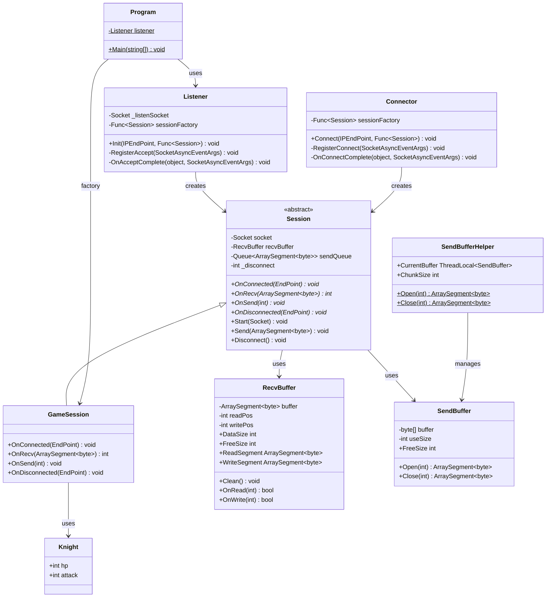
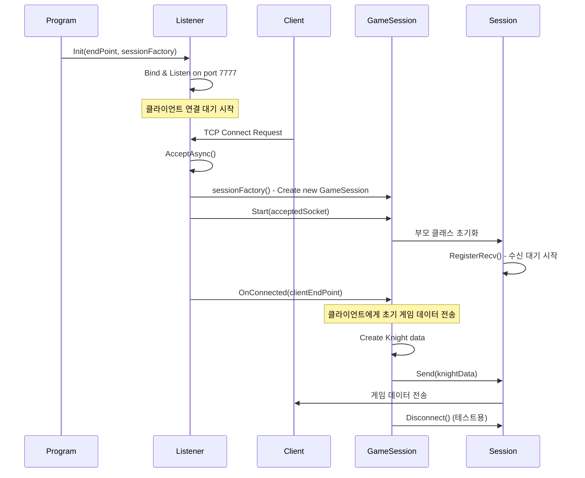
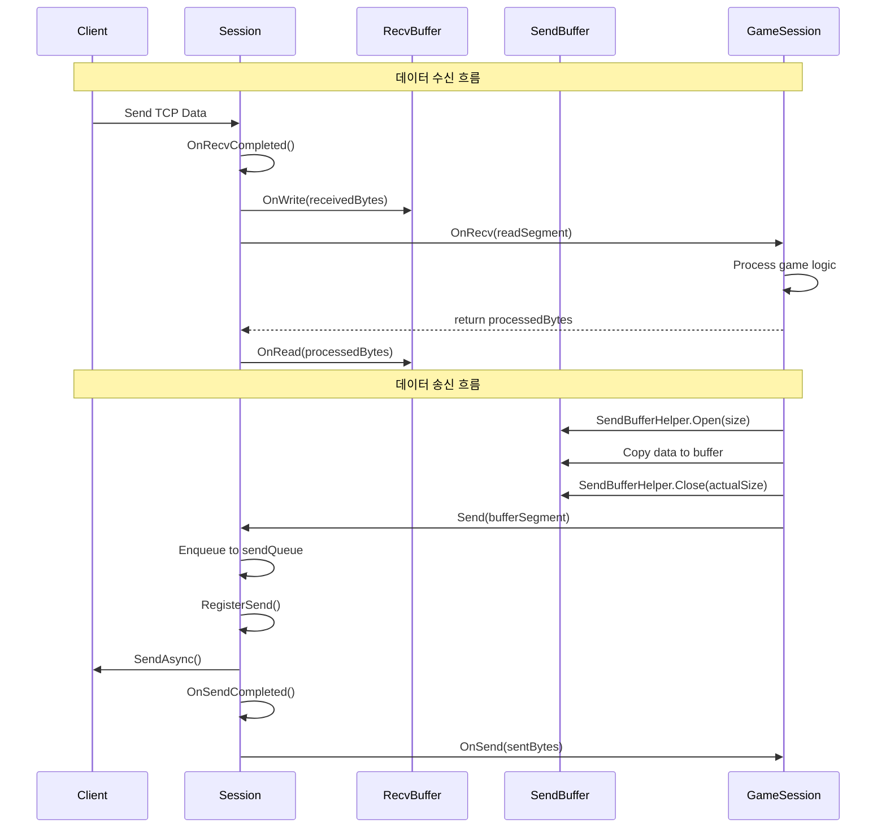
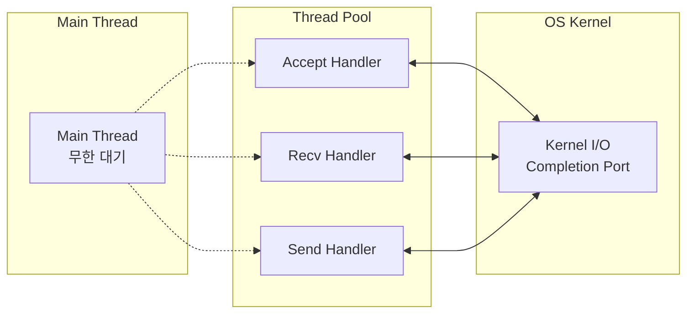

# MMO Server Architecture

## 전체 아키텍처 다이어그램

```mermaid
graph TB
    subgraph "Client Side"
        C[Client Applications]
    end
    
    subgraph "Network Layer"
        N[Network (TCP/IP)]
    end
    
    subgraph "Server Application"
        subgraph "Server Project"
            P[Program.cs<br/>서버 진입점]
            GS[GameSession<br/>게임 로직]
            K[Knight<br/>게임 데이터]
        end
        
        subgraph "ServerCore Library"
            L[Listener<br/>연결 수락]
            S[Session<br/>통신 관리]
            CO[Connector<br/>클라이언트 연결]
            RB[RecvBuffer<br/>수신 버퍼]
            SB[SendBuffer<br/>송신 버퍼]
        end
    end
    
    C ---|TCP Connection| N
    N ---|Accept/Connect| L
    L ---|Create| GS
    GS ---|Inherit| S
    S ---|Use| RB
    S ---|Use| SB
    CO ---|Create| S
    P ---|Initialize| L
    P ---|Create Factory| GS
    GS ---|Use| K
```

## 클래스 관계도



## 데이터 흐름도

### 1. 서버 시작 및 클라이언트 연결 흐름



### 2. 데이터 송수신 흐름



## 네트워크 통신 시퀀스

### 비동기 I/O 처리 과정



## 주요 설계 패턴

### 1. Factory Pattern
- `Listener`와 `Connector`에서 `Func<Session>` 팩토리 사용
- 다양한 타입의 세션을 동적으로 생성 가능

### 2. Template Method Pattern
- `Session` 추상 클래스의 `OnConnected`, `OnRecv`, `OnSend`, `OnDisconnected`
- 하위 클래스에서 게임 로직에 맞게 구현

### 3. Object Pool Pattern
- `SendBufferHelper`의 TLS 기반 버퍼 재사용
- 메모리 할당/해제 비용 최소화

### 4. Observer Pattern
- `SocketAsyncEventArgs`의 `Completed` 이벤트 처리
- 비동기 I/O 완료 시점을 콜백으로 처리